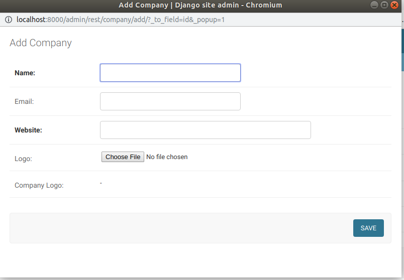
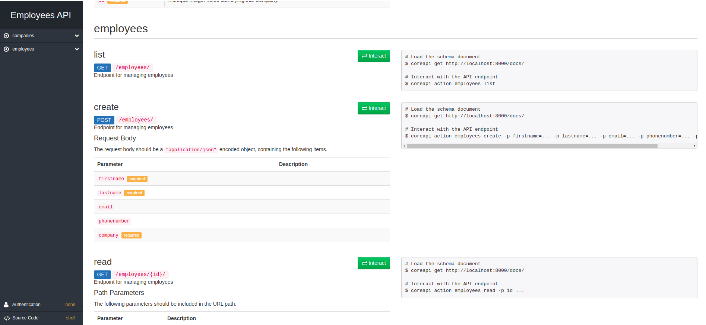

# Touchcore Backend Engineer Test2

Backend Test 2 written using Django

[](https://www.djangoproject.com/)

[](https://travis-ci.org/deven96/touchcore)
[](https://tchcore.herokuapp.com)


## Getting Started

To get this project functional locally follow the steps

- Install Python 3.6 above
- Install Git
- Clone the repo and change into directory
 
 ``` bash
    # use this command on cmd or terminal
    git clone https://github.com/deven96/touchcore.git
    # change into directory
    cd touchcore/
 ```

- Install requirements

```bash
  pip install -r requirements.txt
```

- Run migrations

```bash
  # migrate
  python manage.py migrate
```

- Run the server on default port 8000

```bash
  # runserver
  python manage.py runserver
```


## Admin Panel

- Proceed to http://localhost:8000/admin
- Login using superuser details i.e the one previously filled

## REST API

- Swagger UI for accessing the API endpoints is located at http://localhost:8000/docs
- Companies can only be viewed and not edited. Editing only occurs from the Admin Panel

## Deployed Version

A version of this code is passed through travis and tested then automatically deployed to
https://tchcore.herokuapp.com
The adminpanel login details are as specified in TEST 2 requirements

## Example view

Adding a company from the Admin Panel


REST API

